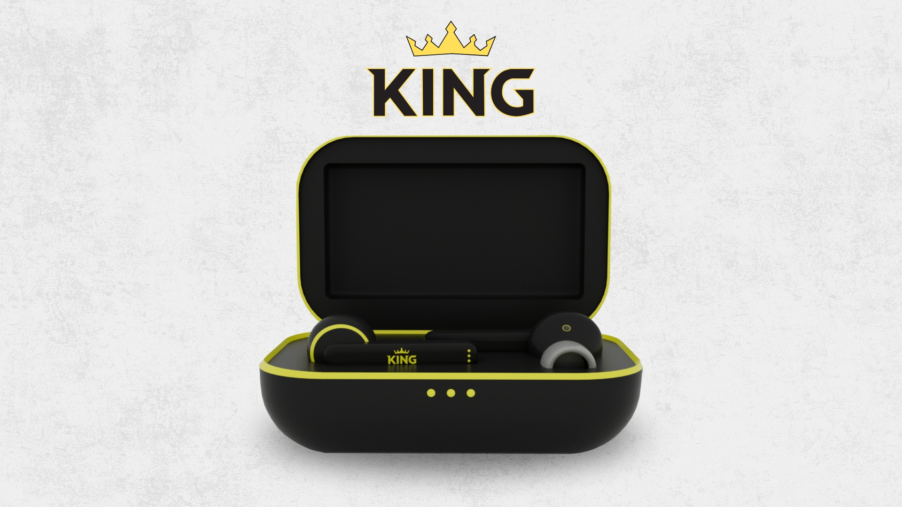

# Kingbuds Project 🎨

Welcome! This project showcases my creative process in designing and developing a unique pair of earbuds and their charging case. It highlights my exploration of form, function, and user experience — blending product design, 3D modeling, and visual storytelling to create an innovative and engaging concept.

## Project Objectives 📑 
Explore Innovative Design: Develop a unique and modern concept for earbuds and a charging case that stand out through form, color, and usability.

Apply 3D Skills: Use Cinema 4D to model, texture, light, and animate the product with attention to realism and detail.

Enhance Visual Communication: Create visuals that clearly present the design’s features, function, and aesthetic appeal.

Develop Presentation Assets: Produce promotional materials and a web layout to showcase the product in a professional and engaging way.

Demonstrate Growth: Reflect personal progress in design thinking, technical skills, and creativity throughout the project process.

## Technologies Used 📘 

Cinema 4D – For 3D modeling, texturing, lighting, and animation of the earbuds and charging case.

Adobe Photoshop – To enhance renders, create textures, and develop promotional visuals.

Adobe Illustrator – For vector elements, logo design, and layout planning.

Adobe After Effects – To create motion graphics and refine the final animation.

HTML, CSS, and JavaScript – For building the promotional website and integrating interactive features.

SASS (SCSS) – To organize and manage styles efficiently using variables, nesting, and mixins.

GSAP (GreenSock Animation Platform) – To create smooth, dynamic animations and transitions for interactive web elements.

## Features ⚙️ 

Fully Responsive
Valid HTML5 & CSS3
GreenSock Animations

## Installation 🧭
To run the portfolio locally:

- Clone this repository
- Navigate into the project directory:
- Open the index.html file in your browser, or if using a local server, start the server and navigate to localhost to view.

## Contact 📫
Feel free to reach out if you’d like to collaborate or have any questions!

Email: [Kingsley Watson](mailto:watsonkingsley38@gmail.com)

Thank you for checking out my earbuds!